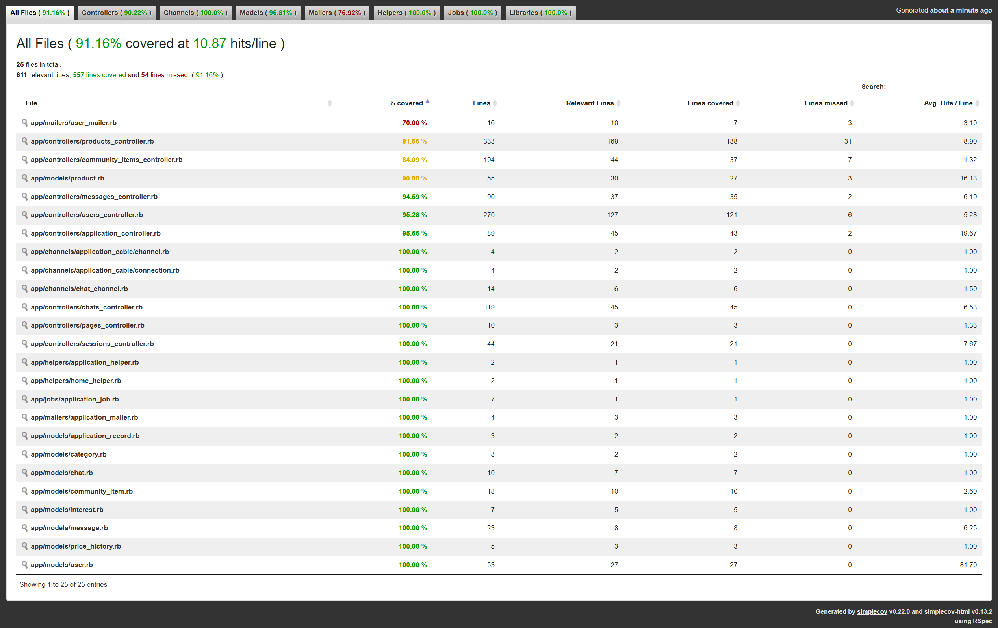

# CSCI3100 Project

A web marketplace project built with Rails and React.

## Features

### CUHK Second-hand Marketplace SaaS
A marketplace platform for CUHK students to exchange products with verified identities and localized logistics.

**Core Features:**
- **Verified Student Community**: Registration requires University ID and hostel information to ensure a safe, scam-protected environment for CUHK members.
- **Localized Promotions**: The community page allow the college students to promote their products to their college, such that additional features, favorable and advertisement can be displayed to the college.
- **Real-time Communication**: Integrated online chatting and community promotions for seamless buyer-seller interaction.
- **Admin Moderation & Operations**:
    - View all registered users in the admin dashboard (`GET /users`).
    - View all admin accounts (`GET /users/admins`).
    - View any user's profile by CUHK ID for support and moderation (`GET /users/:id`).
    - Manually delete any product listing from the frontend when moderation is needed (admin can delete all users' products).

**Advanced Features:**
1. **Fuzzy Search**: Robust search functionality that accounts for typos and vague descriptions to help users find products by similar meaning.
2. **Real-time Notifications**: Instant alerts for sellers when a buyer expresses interest or clicks 'Buy', accelerating the transaction process.
3. **Price & Market Analytics (Chart.js)**: 
    - **Market Statistics**: Visualizes product category distributions.
    - **Price History**: Tracks price changes over time for similar items to inform buyer and seller decisions.

## Tech Stack

- Ruby on Rails 8
- PostgreSQL (development & production)
- React + esbuild
- RSpec + Cucumber

## Quick Start

1. Install system dependencies (Ubuntu/WSL).
```bash
sudo apt update
sudo apt install -y libpq-dev postgresql postgresql-contrib
```

2. Install Ruby and JS dependencies.

```bash
bundle install
npm install
```

3. Set up database.

```bash
# Ensure PostgreSQL is running
sudo service postgresql start
bin/rails db:create db:migrate db:seed
```

4. Start development server.

```bash
bin/dev
```

5. Open http://localhost:3000

## Run Tests

### RSpec
```bash
bundle exec rspec
```

### Cucumber
Cucumber tests require **Google Chrome** and **Chromedriver**.
1. Install Chromedriver using the provided script:
```bash
chmod +x installchromedriver.bash
sudo ./installchromedriver.bash
```
2. Run tests:
```bash
bundle exec cucumber
```

## Feature Ownership

| Feature Name | Primary Developer (Name) | Secondary Developer (Name) | Notes |
|---|---|---|---|
| User Management | Chau Wing Fun(wilsoncc04) | Yeung Chun Hin(HYC442) | Include: Admin, user, login/register management |
| Heroku Implementations | Cheung Tsz Ho(epicercaner) | / | Deploy the service by configuring dynos and addons, and report fail builds on heroku whenever they occur |
| Backend Controllers | Chau Wing Fun(wilsoncc04) | Yeung Chun Hin(HYC442), Cheung Tsz Ho(epicercaner), Zhou Wing Hin(zzzzzz75) | develop API logic |
| Marketplace Core Flows & UI/UX | Zhou Wing Hin(zzzzzz75) | Yeung Chun Hin(HYC442) | Frontend Infrastructure and user flows/interaction designs |
| Database Management | Cheung Tsz Ho(epicercaner) | Yeung Chun Hin(HYC442), Zhou Wing Hin(zzzzzz75) | creating and editing database tables based on needs |
| Search and Filter | Zhou Wing Hin(zzzzzz75) | Cheung Tsz Ho(epicercaner) | Implemented fuzzy search for searching |
| Sorting System | Zhou Wing Hin(zzzzzz75) | / | Implemented sorting by date and price |
| My Own Products | Chau Wing Fun(wilsoncc04) | Yeung Chun Hin(HYC442) | Showing own products sales record |
| Community | Chau Wing Fun(wilsoncc04) | Zhou Wing Hin(zzzzzz75) | Products Promotion |
| Image Management | Cheung Tsz Ho(epicercaner) | Yeung Chun Hin(HYC442) | Handling ActiveStorage for User Avatars and Product images, and for cloudinary configuration in heroku deployment |
| RSpec Testing | Chau Wing Fun(wilsoncc04) | / | TDD testing for the project |
| Platform management | Zhou Wing Hin(zzzzzz75) | Yeung Chun Hin(HYC442) | WSL/Selenium Config |
| UI/UX Optimization | Zhou Wing Hin(zzzzzz75) | Yeung Chun Hin(HYC442) | Styling and Interaction designs |
| Market Visualizations(chart.js) | Zhou Wing Hin(zzzzzz75) | / | Market Statistics and Price History |
| Chat and messages | Chau Wing Fun(wilsoncc04) | Yeung Chun Hin(HYC442) | Action cable |
| Cucumber Testing | Zhou Wing Hin(zzzzzz75), Yeung Chun Hin(HYC442) | Cheung Tsz Ho(epicercaner) | BDD testing for the project |
| Profile Management | Yeung Chun Hin (HYC442) | / | User Profile Editing and security management |
| Real-time Notification | Yeung Chun Hin(HYC442) | / | implementing instant alerts|
| Interested/Purchase | Yeung Chun Hin(HYC442) | / | calling action after click|
| Interaction Feedback | Zhou Wing Hin(zzzzzz75) | / | notifying system (alert & confirm) |


Testing coverage:
**Testing coverage**

- **RSpec (SimpleCov):** 91.16%


